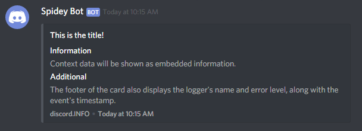

# jspapp/monolog-discord-handler

## Installation
`composer require jspapp/monolog-discord-handler`

## Usage
```php
<?php

require 'vendor/autoload.php';

use jspapp\MonologDiscord\DiscordHandler;

$webhook = 'Your Webhook URL';

$log = new Monolog\Logger('discord');
$log->pushHandler(new DiscordHandler($webhook, Logger::INFO));

$log->info('This is the title!', [
  'Information' => 'Context data will be shown as embedded information.',
  'Additional' => 'The footer of the card also displays the logger\'s name and error level, along with the event\'s timestamp.'
]);
```



## Laravel Log Driver

Import the log driver into `config/logging.php`:
```php
use jspapp\MonologDiscord\Laravel\DiscordChannel;
```
and add the following driver configuration:
```php
'discord' => [
  'driver' => 'custom',
  'via' => DiscordChannel::class,
  'webhook' => env('LOG_DISCORD_WEBHOOK'),
],
```

### Rate Limit Note
I did what I could to respect Discord's rate limit, but adding the driver to Laravel's default log stack gave me issues. Use with caution in production environments, and consider selectively using:
```php
Log::channel('discord')->info('Message');
```
instead of catching everything.